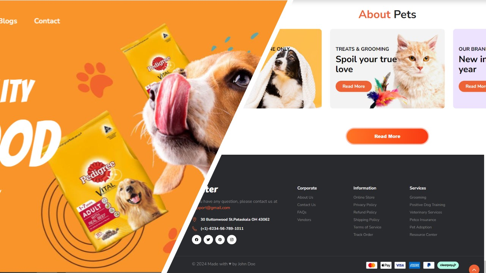

<div align="center">

  <h1 align="center">🥣Kitty - Animal Food🥣</h1>

  Kitty is a kind of website selling animal products, <br /> Proper feeding means lovely and healthy pets 

<br>

  <a href="https://github.com/salahlisahil"><strong> 📺 Live</strong></a> 

</div>

<br />

### ☑ Preview



<br>

### ☑ Requisites

Before you begin, ensure you have met the following requirements:

* [Git](https://git-scm.com/downloads "Download Git") and [Python](https://www.python.org/downloads/) must be installed on your operating system.

<br>

### ☑ Run Locally

To run **Kitty** locally, run following commands consecutively on your git bash:
```
 python -m venv .
```
```
cd Scripts
```
```
./activate
```
```
pip install -r requirements.txt
```
```
flask --app run run
```

<br>

### ☑ Technologies used

<br>

<div align="center">


</div>

<br>

### ☑ Contact

If you want to contact me, you can reach me over [Twitter](https://www.twitter.com/sahil_salahli), [Facebook](https://www.facebook.com/S.Salahli), [Instagram](https://instagram.com/salahli.sahil), [Linkedin](https://www.linkedin.com/in/salahlisahil)

<br>

### ☑ License

This project is **free to use** and does not contain any license.


<br>

### ☑ Creators

The project got prepared by a consistent effort of [Sahil](https://github.com/salahlisahil)

<br>

<div align="center">
  
  
  
  
[](https://twitter.com/sahil_salahli)
  [](https://youtube.com)
  

</div>
